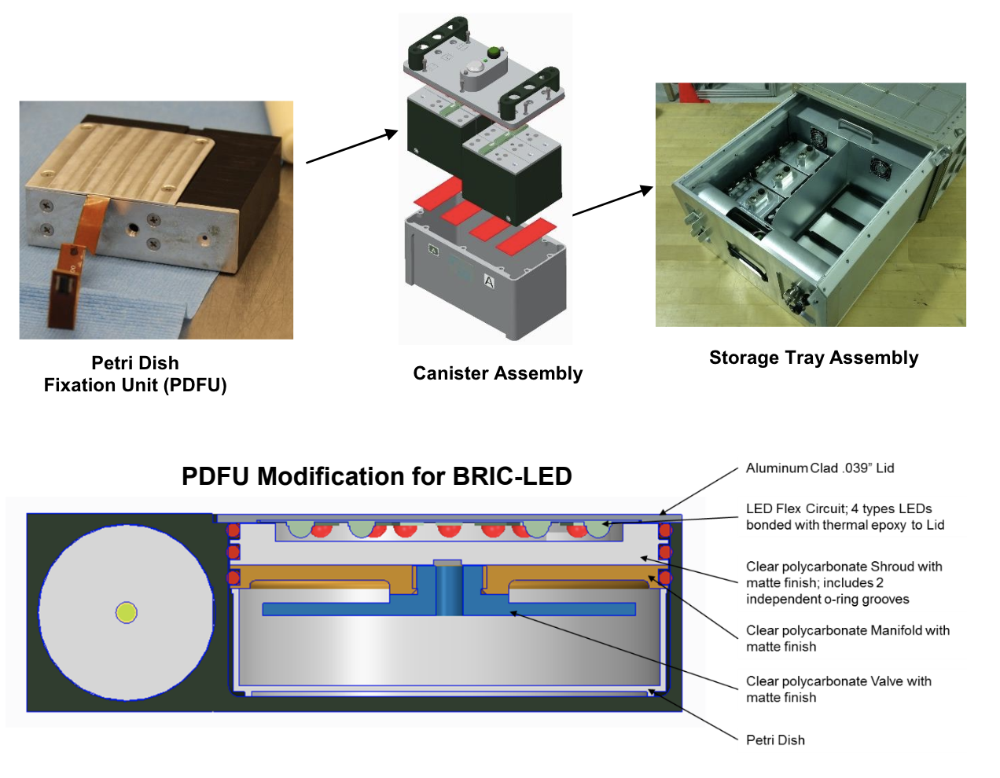

# BRIC LED technology demonstration

## BRIC\_LED\_AWG&#x20;

**Hardware feature: red and blue LED lights providing cycles of 4 hours light and 4 hours dark.**&#x20;

<figure><figcaption></figcaption></figure>

**Samples**

Factors matrix sourced from NASA Open Science Repository sample metadata. Counts matrix derived from NASA GeneLab pipeline data products. FASTQ files processed via the NASA GeneLab pipeline. \*\*Wild-type Arabidopsis Col-0, shoots isolated for RNA sequencing.

<figure><figcaption></figcaption></figure>


## **This R markdown file was generated by Dr Richard Barker as part of a preliminary analysis.**&#x20;


#### Setting up the Environment

First, ensure your working directory is set to where your files are saved. Change `<your-path>` to your specific directory.

```r
setwd('C:/Users/DRB/Downloads') # Change to your drive
```

#### File Paths

Define the paths to the necessary files.

```r
inputFile <- 'Downloaded_Converted_Data.csv' # Expression matrix
sampleInfoFile <- 'Downloaded_sampleInfoFile.csv' # Experimental design
geneInfoFile <- 'Arabidopsis_thaliana__athaliana_eg_gene_GeneInfo.csv' # Gene info
geneSetFile <- 'Arabidopsis thaliana__athaliana_eg_gene.db' # Pathway database (SQL/GMT format)
STRING10_speciesFile <- 'https://raw.githubusercontent.com/iDEP-SDSU/idep/master/shinyapps/idep/STRING10_species.csv' # STRING species data
```

#### Loading Required Functions

Check if the `iDEP_core_functions.R` file exists locally. If not, load it from the provided URL.

```r
if (file.exists('iDEP_core_functions.R')) {
    source('iDEP_core_functions.R')
} else {
    source('https://raw.githubusercontent.com/iDEP-SDSU/idep/master/shinyapps/idep/iDEP_core_functions.R')
}
```

#### Installing Packages: Ensure all required packages from `iDEP_core_functions.R` are installed.

**Overview of iDEP Core Functions (`iDEP_core_functions.R`)**

The `iDEP_core_functions.R` script is integral to the iDEP software, supporting various core functionalities that were installed in order to complete this analysis.&#x20;

Here are key highlights:

* **Data Preprocessing**: Functions for data normalization, filtering, and transformation.
* **Analysis Modules**: Includes statistical analysis, clustering, and differential expression analysis.
* **Visualization Tools**: Implements methods for generating plots and visual representations of the data.
* **Integration Capabilities**: Facilitates interaction with external databases and resources for enriched analysis.

#### Reading Data

Set up chunk options for reproducibility and clarity.

```r
knitr::opts_chunk$set(echo = TRUE)
knitr::opts_chunk$set(fig.width=6, fig.height=5, fig.align = 'center')
```

This script sets up the environment and reads data for further analysis.&#x20;

## Parameters for reading data

````r
```r
# Load data
readData.out <- readData(inputFile)
library(knitr) # Install if needed for kable tables
kable(head(readData.out$data)) # Display first few rows of data

# Load sample information 
readSampleInfo.out <- readSampleInfo(sampleInfoFile)
kable(readSampleInfo.out) 

# Input settings
input_selectOrg = "NEW"
input_selectGO = 'KEGG' # Gene set category
input_noIDConversion = TRUE

# Generate gene information
allGeneInfo.out <- geneInfo(geneInfoFile)
converted.out = NULL
convertedData.out <- convertedData()

# Filter genes
nGenesFilter()

# Convert counts (for compatibility)
convertedCounts.out <- convertedCounts() 

# Missing values imputation method
input_missingValue <- 'geneMedian'

# Data file format settings
input_dataFileFormat <- 1 # 1- read counts, 2- FKPM/RPKM or DNA microarray
input_minCounts <- 0.5 # Minimum counts
input_NminSamples <- 1 # Minimum number of samples 

# Transformation settings
input_countsLogStart <- 4 # Pseudo count for log CPM 
input_CountsTransform <- 1 # Methods for data transformation (1- EdgeR's logCPM, 2- VST, 3- rlog)
````

## **2. Pre-process**

**The remaining 36 genes retained their original IDs.**&#x20;

**From 18108 genes, 18072 were successfully converted to Ensembl gene IDs in our database.**&#x20;

**Total genes: 32833 across 12 samples.**

## Read counts per library

```r
# Save current graphical parameters
parDefault <- par() 

# Set new margin sizes
par(mar = c(12, 4, 2, 2))
```

## barplot of total read counts

````markdown
```R
# Plot total read counts in millions
barplot(colSums(x) / 1e6, col = col1, las = 3, main = "Total Read Counts (Millions)")

# Detect bias in sequencing depth
readCountsBias()

# Prepare data and groups
x <- readData.out$rawCounts
groups <- as.factor(detectGroups(colnames(x)))

# Set colors based on the number of groups
if (nlevels(groups) <= 1 | nlevels(groups) > 20) {
  col1 <- 'green'
} else {
  col1 <- rainbow(nlevels(groups))[groups]
}
````

<figure><figcaption></figcaption></figure>

## Box plot

```r
x <- readData$out$data
boxplot(x, las = 2, col = col1, ylab = 'Transformed Expression Levels', main = 'Distribution of Transformed Data')
```

<figure><figcaption></figcaption></figure>

## Density plot

To create a density plot, use:

```r
densityPlot()
```

To customize plotting parameters, use:

```r
par(parDefault)
```


\


<figure><figcaption></figcaption></figure>

## Scatter plot of the first two samples

Create a scatter plot for the first two samples:

```R
plot(x[,1:2], xlab=colnames(x)[1], ylab=colnames(x)[2], main='Scatter plot of first two samples')
```

<figure><figcaption></figcaption></figure>

## Dispersion plot


## QC PLots


**Plot gene or gene family**

#### Input Parameters

* **input\_selectOrg**: "BestMatch"
* **input\_geneSearch**: 'ATHDSP22, BAG6, DOX1, DREB2B, HSP101, HSP23.6-MITO, HSP70, HSP70b, RPL23.1, RPS12C, TCH4, XTH15, XTH33'
* **input\_useSD**: 'FALSE'

#### Function Calls

* `genePlot()`
* `geneBarPlotError()`


All mitochondrial genes and BAG6&#x20;

<figure><figcaption></figcaption></figure>

### Three microRNA's were detected.

<figure><figcaption></figcaption></figure>

**mir163** (source: https://www.mirbase.org/hairpin/MI0000196)

11 papers mentioning ath-MIR163 are open access articles associated with the species _Arabidopsis thaliana_ that mention the gene name MIR163. "Defence, Hawaiian shirt, and cytokinin"

<figure><figcaption></figcaption></figure>

"miR163 and its targets act in concert to modulate defense responses against bacterial pathogen in A. thaliana." (Ref https://pubmed.ncbi.nlm.nih.gov/28401908/).


<figure><figcaption><p>Source: https://pubmed.ncbi.nlm.nih.gov/29244865/ </p></figcaption></figure>

**Athamapp can be used to look for miRNA targets**&#x20;



**\*\*All mir targets mapped on the chromosomes\*\***


**MIR163 Target Gene Search parameters**

Upstream region: 0\
Downstream region: 1000\
Filter: Trans targets with psRNATarget score <= 2.5\
MicroRNA orientation: -/+\
Sort by: Gene\
Total genes detected: 18\
Predicted small RNA-regulated genes (italicized): 8

\*\*Target gene search parameter

**Target Gene MicroRNA Family Position Relative Orientation Relative Distance psRNATarget Score**

* At1g15125.1 | MIR163 | MIR163 | 5204954 | - | 334 | 2.0
* At1g15900.1 | MIR163 | MIR163 | 5465300 | - | 950 | 2.0
* At1g35990.1 | MIR163 | MIR163 | 13416034 | - | 247 | 2.5
* At1g54990.1 | MIR163 | MIR163 | 20515213 | - | 27 | 2.5
* At1g66690.1 | MIR163 | MIR163 | 24874064 | - | 449 | 2.0
* At1g66700.1 | MIR163 | MIR163 | 24877969 | - | 452 | 2.0
* At1g66720.1 | MIR163 | MIR163 | 24885267 | - | 424 | 2.5
* At2g20580.1 | MIR163 | MIR163 | 8866726 | + | 657 | 1.5
* At2g25570.1 | MIR163 | MIR163 | 10894492 | + | 507 | 2.5
* At2g36070.1 | MIR163 | MIR163 | 15154545 | + | 665 | 2.0
* At3g44840.1 | MIR163 | MIR163 | 16384341 | - | 403 | 2.0
* At4g05635.1 | MIR163 | MIR163 | 2995469 | - | 45 | 2.5
* At4g28470.1 | MIR163 | MIR163 | 14071893 | + | 656 | 2.5
* At5g15805.1 | MIR163 | MIR163 | 5158160 | - | 518 | 2.5
* At5g15810.1 | MIR163 | MIR163 | 5158160 | - | 359 | 2.5
* At5g35630.1 | MIR163 | MIR163 | 13847942 | - | 283 | 2.5
* At5g38100.1 | MIR163 | MIR163 | 15217856 | - | 559 | 1.5
* At5g61250.1 | MIR163 | MIR163 | 24651498 | + | 533 | 2.5



1https://knetminer.com/beta/knetspace/network/910ae6a2-3ce9-4887-9039-c6ffd04a98eb


**mir167D** [Source](https://www.mirbase.org/hairpin/MI0000975)

Related to: Auxin, innate immune system, and starvation stress response.

<figure><figcaption></figcaption></figure>

**mir167D Target gene search parameter:**&#x20;

**Predicted Small RNA-Regulated Genes**

* Number of predicted small RNA-regulated genes: _2_
* Upstream region: 0
* Downstream region: 1000
* Total number of gene IDs detected: 2
* Sort by: Gene
* Relative microRNA orientation: -/+
* Show only trans targets
* psRNATarget score <= 2.5


**Target gene MicroRNA Family Position Relative orientation Relative distance psRNATarget score** At3g04765.1 MIR167D MIR167 1306638 - 149 1.5 At3g04765.1 MIR167D MIR167 1306756 + 31 1.5 At3g22886.1 MIR167D MIR167 8108097 + 69 0.0 At3g22886.1 MIR167D MIR167 8108176 - 148 2.0

**At3g22886 is mir167a.**&#x20;

**At3g04765 is mir167c.**

**mir824A** Involved in flowering time and stomatal development.&#x20;

**Source:** https://bar.utoronto.ca/thalemine/report.do?id=5366079


### microRNA Target search p**arameters**:

* Upstream region: 0
* Downstream region: 1000
* Target type: Trans targets
* psRNATarget score: ≤ 2.5
* Relative microRNA orientation: -/+
* Sort by: Gene

**Results**:

* **Total number of gene IDs detected**: 2
* **Number of predicted small RNA-regulated genes (**_**italicized**_**)**: 1

Target gene MicroRNA Family Position Relative orientation Relative distance psRNATarget score At3g12460.1 MIR824 MIR824 3954713 + 717 2.5 At3g44400.1 MIR824 MIR824 16060075 - 580 2.5

AT3G44400 = Disease resistance protein (TIR-NBS-LRR class) family At3g12460 = Polynucleotidyl transferase, ribonuclease H-like superfamily protein

## **3. Heatmap**

## hierarchical clustering tree

x <- readData.out$data maxGene <- apply(x,1,max)

## remove bottom 25% low expressed genes (which inflate the PPC)

### Correlation Matrix

```r
input_labelPCC <- TRUE # Show correlation coefficient?
correlationMatrix()

x <- x[which(maxGene > quantile(maxGene)[1]),]
plot(as.dendrogram(hclust2(dist2(t(x)))), ylab="1 - Pearson C.C.", type = "rectangle")
```

## Parameters for heatmap

* **input\_nGenes**: 300 (Top genes for heatmap)
* **input\_geneCentering**: TRUE (Center genes)
* **input\_sampleCentering**: FALSE (Center by sample)
* **input\_geneNormalize**: TRUE (Normalize by gene)
* **input\_sampleNormalize**: FALSE (Normalize by sample)
* **input\_noSampleClustering**: FALSE (Use original sample order)
* **input\_heatmapCutoff**: 4 (Remove outliers beyond number of SDs)
* **input\_distFunctions**: 1 (Distance function)
* **input\_hclustFunctions**: 1 (Linkage type)
* **input\_heatColors1**: 2 (Colors)
* **input\_selectFactorsHeatmap**: 'Treatment' (Sample coloring factors)

```r
png('heatmap.png', width = 10, height = 15, units = 'in', res = 300)
staticHeatmap()
dev.off()
```

<figure><figcaption></figcaption></figure>

## **4. K-means clustering**

#### K-Means Clustering

#### k-Means Clustering Parameters

* **Number of genes for k-Means:** 2000
* **Number of clusters:** 4
* **Maximum genes for clustering:** 12000
* **Normalization method:** geneMean
* **Random seed (k-Means re-run):** 0

**Number of Clusters**

```python
KmeansNclusters() 
```

Determine the number of clusters for K-means.

**Running K-Means**

```python
Kmeans.out = Kmeans()
```

Execute the K-means clustering algorithm.

**Heatmap for K-Means**

```python
KmeansHeatmap()
```

Generate a heatmap for the K-means clustering results.

<figure><figcaption><p>heat map ER cluster</p></figcaption></figure>

####

#### Additional Parameters

* \*\*Standard Deviation Distribution

<figure><figcaption></figcaption></figure>


## **#** Gene Set **enrichment analysis** and Visualization

### Read Gene Sets

```r
GeneSets.out <- readGMTRobust('somefile.GMT')
```

### K-Means Clustering and Enrichment Analysis

```r
results <- KmeansGO()  # Perform enrichment analysis for k-Means clusters
results$adj.Pval <- format(results$adj.Pval, digits=3)
kable(results, row.names=FALSE)
```

### t-SNE Visualization for Genes

```r
input_seedTSNE <- 0  # Set random seed for t-SNE
input_colorGenes <- TRUE  # Color genes in t-SNE plot
tSNEgenePlot()  # Plot genes using t-SNE
```

### Database Connection

```r
sqlite <- dbDriver('SQLite')
```

### Read Gene Sets with Filters

```r
input_selectGO3 <- 'GOBP'  # Gene set category
input_minSetSize <- 5  # Minimum gene set size
input_maxSetSize <- 2000  # Maximum gene set size
GeneSets.out <- readGeneSets(geneSetFile, convertedData.out, input_selectGO3, input_selectOrg, c(input_minSetSize, input_maxSetSize))
```

## **5. PCA and beyond**

```markdown
input_selectFactors <- 'Treatment' # Factor coded by color
input_selectFactors2 <- 'Treatment' # Factor coded by shape
input_tsneSeed2 <- 0 # Random seed for t-SNE
# PCA, MDS, and t-SNE plots
PCAplot()
```

<figure><figcaption></figcaption></figure>

<figure><figcaption><p>PCA SCREE plot</p></figcaption></figure>

## **Read gene sets for pathway analysis using PGSEA on principal components**

````markdown
```r
input_selectGO6 <- 'All' # Select gene set category
GeneSets.out <- readGeneSets(geneSetFile, convertedData.out, input_selectGO6, input_selectOrg, c(input_minSetSize, input_maxSetSize))

PCApathway() # Run PGSEA analysis

cat(PCA2factor()) # Display the correlation between PCs and factors
````


## **6. DEG1**

## Input Parameters

* **Counts DEG Method**: 3 (DESeq2)
* **P-value Cutoff**: 0.1 (FDR cutoff)
* **Fold-change Cutoff**: 2
* **Selected Comparisons**:
  * Comparisons: `Treatment: Flight vs. Ground`
  * Factors Model: `Treatment`
* **Interactions**: None
* **Block Factors Model**: None
* \*\*Factor Reference Levels

**# number of DEGs as figure sigGeneStatsTable() # number of DEGs as table**


## **7. DEG2**

```markdown
`input_selectContrast <- 'Flight-Ground'` # Selected comparisons
`selectedHeatmap.data.out <- selectedHeatmap.data()` # Generate data for the heatmap
`selectedHeatmap()` # Generate heatmap for DEGs in the selected comparison
```

## Save gene lists and data into files

input\_selectGO2 <- 'GOBP' # Gene set category

* `geneListData.out <- geneListData()`
* `volcanoPlot()`
* `write.csv(selectedHeatmap.data()$genes, 'heatmap.data.csv')`
* `write.csv(DEG.data(), 'DEG.data.csv')`
* `write(AllGeneListsGMT(), 'AllGeneListsGMT.gmt')`

<figure><figcaption></figcaption></figure>

**`scatterPlot()`**&#x20;

<figure><figcaption></figcaption></figure>

**`MAplot()`**&#x20;

<figure><figcaption></figcaption></figure>

## Genome ontology geneset enrichment analysis

````markdown
```R
# Read gene sets
GeneSets.out <- readGeneSets(geneSetFile, convertedData.out, input_selectGO2, input_selectOrg, c(input_minSetSize, input_maxSetSize))

# Option to remove highly redundant gene sets
input_removeRedundantSets <- TRUE

# Perform enrichment analysis
results <- geneListGO()

# Format adjusted p-values
results$adj.Pval <- format(results$adj.Pval, digits=3)

# Display results
kable(results, row.names = FALSE)
````

`geneListGOTable.out <- geneListGOTable()`

<figure><figcaption><p>Defence cluster</p></figcaption></figure>

**Enrichment analysis using (STRING and metascape protein interaction networks analysis IS NOT INCLUDED)**

### Protein-Protein Interaction (PPI) Analysis using STRING-db

```r
write(stringDB_network_link(), 'PPI_results.html')  # Save results to an HTML file
browseURL('PPI_results.html')  # Open the results in a web browser
```

#### Parameters

**input\_nGenesPPI**: Number of top genes for PPI retrieval and analysis.

```r
input_nGenesPPI <- 100
```

#### Generate and display PPI Network:  Generate interactive PPI network:&#x20;

```r
stringDB_network1(1)  # Show PPI network
```

```r
STRINGdb_geneList.out <- STRINGdb_geneList()  # Convert gene lists
input_STRINGdbGO <- 'Process'  # Options: 'Process', 'Component', 'Function', 'KEGG', 'Pfam', 'InterPro'
results <- stringDB_GO_enrichmentData()  # Enrichment analysis using STRING-db
results$adj.Pval <- format(results$adj.Pval, digits=3)
kable(results, row.names=FALSE)  # Create a table of results
```

More information coming soon...



## **8. Pathway analysis**&#x20;

`input_selectContrast1 <- 'Flight-Ground' #select Comparison`&#x20;

\#input\_selectContrast1 = limma.out$comparisons\[3]&#x20;

`manually set input_selectGO <- 'KEGG'`&#x20;

\#Gene set category&#x20;

\#input\_selectGO='custom'&#x20;

## Read pathway data again

### Pathway Analysis Methods

#### Pathway Method: fgsea

1.  Import fgsea pathway data:

    ```r
    fgseaPathwayData.out <- fgseaPathwayData()
    ```
2.  Perform enrichment analysis for k-Means clusters and format results:

    ```r
    results <- fgseaPathwayData.out
    results$adj.Pval <- format(results$adj.Pval, digits=3)
    kable(results, row.names=FALSE)
    ```
3.  Visualize pathway analysis:

    ```r
    pathwayListData.out = pathwayListData()
    enrichmentPlot(pathwayListData.out, 25)
    enrichmentNetwork(pathwayListData.out)
    enrichmentNetworkPlotly(pathwayListData.out)
    ```

## Down-regulated Biological Pathway Genome Ontology&#x20;

<figure><figcaption></figcaption></figure>

## Up-regulated Biological Pathway Genome Ontology

<figure><figcaption></figcaption></figure>


### Pathway Method: PGSEA

1.  Import PGSEA pathway data:

    ```r
    gagePathwayData.out <- gagePathwayData()
    ```
2.  Perform enrichment analysis for k-Means clusters and format results:

    ```r
    results <- gagePathwayData.out
    results$adj.Pval <- format(results$adj.Pval, digits=3)
    kable(results, row.names=FALSE)
    ```
3.  Visualize pathway analysis:

    ```r
    pathwayListData.out = pathwayListData()
    enrichmentPlot(pathwayListData.out, 25)
    enrichmentNetwork(pathwayListData.out)
    enrichmentNetworkPlotly(pathwayListData.out)
    ```

<figure><figcaption><p>BRIC-LED shoot RNAseq FL vs GC secondary metabolism </p></figcaption></figure>

### Pathway Method: GAGE

1.  Import GAGE pathway data:

    ```r
    gagePathwayData.out <- gagePathwayData()
    ```
2.  Perform pathway analysis using GAGE:

    ```r
    GeneSets.out <- readGeneSets(geneSetFile, convertedData.out, input_selectGO, input_selectOrg, c(input_minSetSize, input_maxSetSize))
    ```
3.  Set pathway analysis parameters:

    ```r
    input_pathwayPvalCutoff <- 0.2 # FDR cutoff
    input_nPathwayShow <- 30 # Top pathways to show
    input_absoluteFold <- FALSE # Use absolute values of fold-change?
    input_GenePvalCutoff <- 1 # FDR to remove genes
    ```

**ER cluster plotted using KEGG path view**&#x20;

<figure><figcaption><p>KEGG pathview</p></figcaption></figure>


## **9. Chromosome**  enrichment analysis&#x20;

#### Chromosomal region expression enrichment analysis&#x20;

* **Comparison**: `Flight-Ground`
* **FDR for Filtering Genes**:
  * P-value threshold: `0.1`
  * Fold-change threshold: `2`

**Command to Visualize Data**:

```R
genomePlotly() # Displays fold-changes on the genome
```

<figure><figcaption><p>Chromosomal Enrichment </p></figcaption></figure>

### **10. Biclustering**&#x20;

#### Biclustering Gene Analysis

* **Number of Genes for Biclustering**: 1000
* **Biclustering Method**: `BCCC()`
*   **Run Biclustering Analysis**:

    ```R
    biclustering.out = biclustering()
    ```
* **Select Bicluster**: 1
*   **Generate Heatmap for Selected Cluster**:

    ```R
    biclustHeatmap()
    ```
* **Gene Set Category**: `GOBP`


_**Note:** Graphs are not included as they were deemed unnecessary; the WGCNA captured most data features. See below for more details._


### Read pathway data again

`GeneSets.out <- readGeneSets(geneSetFile, convertedData.out, input_selectGO4, input_selectOrg, c(input_minSetSize, input_maxSetSize))`

`results <- geneListBclustGO() # Enrichment analysis for k-Means clusters`

`results$adj.Pval <- format(results$adj.Pval, digits=3)`

`kable(results, row.names=FALSE)`


### **11. Co-expression network**&#x20;

````markdown
### WGCNA Configuration

- **Soft Power Threshold:** 8
- **Top Genes in Network:** 1000
- **Minimum Module Size:** 20

### Commands
Run WGCNA analysis:
```R
wgcna.out = wgcna()
````

Generate soft power curve:

```R
softPower()
```


`modulePlot() # plot modules`


`listWGCNA.Modules.out` is initialized with the `listWGCNA.Modules()`&#x20;

This function creates WGCNA modules containing loci with ontology group and similar expression changes in the experimental data.


***

### Now analyse each of the cluster with GO biological processes

`input_selectGO5 <- 'GOBP' #Gene set category`

***

## **Entire WSGNCA network summary as dendrogram of biological processes.**&#x20;


***

### **Turquoise cluster (273)**

<figure><figcaption></figcaption></figure>

&#x20;`Turquoise cluster` &#x20;

<figure><figcaption></figcaption></figure>

`Turquoise cluster -> input_selectGO <- 'GOBP' #Gene set category and plot`

<figure><figcaption></figcaption></figure>

***

### **Blue Cluster (173)**

<figure><figcaption></figcaption></figure>

&#x20;Blue Cluster &#x20;

<figure><figcaption></figcaption></figure>

`Blue Cluster -> input_selectGO <- 'GOBP' #Gene set category and plot`

<figure><figcaption></figcaption></figure>

***

### **Brown Cluster (96)**

<figure><figcaption></figcaption></figure>

&#x20;Brown Cluster &#x20;

<figure><figcaption></figcaption></figure>

`Brown Cluster -> input_selectGO <- 'GOBP' #Gene set category and plot`

<figure><figcaption></figcaption></figure>

***

### **Yellow Cluster (91)**

<figure><figcaption></figcaption></figure>

&#x20;Yellow Cluster &#x20;

<figure><figcaption></figcaption></figure>

`Yellow Cluster -> input_selectGO <- 'GOBP' #Gene set category and plot`

<figure><figcaption></figcaption></figure>

***


**Green Cluster (63)**

**Green Cluster** &#x20;

<figure><figcaption></figcaption></figure>

`Green Cluster  -> input_selectGO <- 'GOBP' #Gene set category and plot`

<figure><figcaption></figcaption></figure>

***

**Red Cluster (59)**

<figure><figcaption></figcaption></figure>

&#x20;Red Cluster &#x20;

<figure><figcaption></figcaption></figure>

`Red Cluster -> input_selectGO <- 'GOBP' #Gene set category and plot`

<figure><figcaption></figcaption></figure>

***

### **Black Cluster (58)**

<figure><figcaption></figcaption></figure>

&#x20;Black Cluster &#x20;

<figure><figcaption></figcaption></figure>

**`Black Cluster`**` ``-> input_selectGO <- 'GOBP' #Gene set category and plot`

<figure><figcaption></figcaption></figure>

***

### **Pink Cluster (XX)**

<figure><figcaption></figcaption></figure>

&#x20;Pink Cluster &#x20;

<figure><figcaption></figcaption></figure>

`Pink Cluster -> input_selectGO <- 'GOBP' #Gene set category and plot`

<figure><figcaption></figcaption></figure>

***

### **Magenta Cluster (52)**

<figure><figcaption></figcaption></figure>

&#x20;Magenta Cluster &#x20;

`Magenta Cluster -> input_selectGO <- 'GOBP' #Gene set category and plot`

<figure><figcaption></figcaption></figure>

***

### **Purple Cluster (50)**

<figure><figcaption></figcaption></figure>

&#x20;Purple Cluster &#x20;

`Purple Cluster -> input_selectGO <- 'GOBP' #Gene set category and plot`

<figure><figcaption></figcaption></figure>

***

### **Green/yellow (24 genes)**

<figure><figcaption></figcaption></figure>

&#x20;Green/yellow &#x20;

`Green/yellow -> input_selectGO <- 'GOBP' #Gene set category and plot`

<figure><figcaption></figcaption></figure>

***

## Read pathway data again

### Gene Set Analysis

#### Remove Redundant Gene Sets

```R
input_removeRedundantSets <- TRUE # Remove redundant gene sets
```

#### Enrichment Analysis

```R
results <- networkModuleGO() # Enrichment analysis of selected module
results$adj.Pval <- format(results$adj.Pval, digits=3)
kable(results, row.names=FALSE)
```

#### Read Gene Sets

```R
GeneSets.out <- readGeneSets(geneSetFile, convertedData.out, input_selectGO5, input_selectOrg, c(input_minSetSize, input_maxSetSize))
```

#### Select a Module

```R
input_selectWGCNA.Module <- '1. turquoise (255 genes)' # Select a module
```

#### Network Module Configuration

```R
input_topGenesNetwork <- 10 # Soft power cutoff
input_edgeThreshold <- 0.4 # Edge threshold
```

#### Display Network of Top Genes

```R
moduleNetwork() # Show network of top genes in selected module
```

**Table listing all the genes and summary statics generated by the WGCNA analysis can be found in our github repo.**&#x20;

**Thanks for reading.**&#x20;
